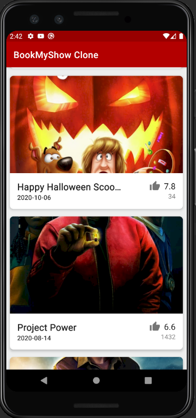
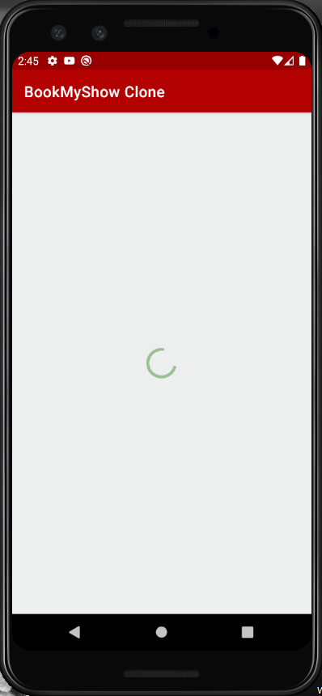

# BookMyShow Clone Android App

In the mobile (android) track of the virtual DevFest India 2020, the speakers build a clone of BookMyShow App using UI basics, loading dynamic content from the server and how to make the app available run offline.

## Homescreen UI

## Sending http request to the server
